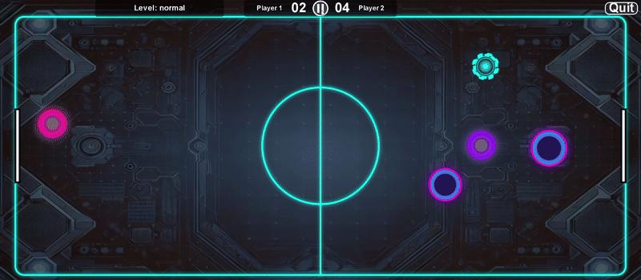

# 2025 Group-6

---

# 🏒 **Welcome to Puck Power Clash!** 🏒

---

### ▶️ [PLAY THE GAME](https://uob-comsm0166.github.io/2025-group-6/)

### 📁 [Browse the Game Files](/docs/ppc)
Github pages are deployed with a workflow created using github
template [jekyll-gh-pages.yml](.github/workflows/jekyll-gh-pages.yml).

### 🎥 [Watch the Game Video Below 👇](https://youtu.be/ydO87DNYbCo) 

[Microsoft Stream Link](https://uob-my.sharepoint.com/:v:/g/personal/jh24162_bristol_ac_uk/EbgwLkkjEFVMs9BvXptVfS4BXJwdVGjwaJHgLJgtBzR73w?e=ogvIaT)

---

## The Avengers

| Group Member | Name                     | Email                 | Role                       | GitHub Username                                          |
|--------------|--------------------------|-----------------------|----------------------------|----------------------------------------------------------|
| 1            | Saquib Sayeed Kazi       | jh24162@bristol.ac.uk | Developer/ Project Manager | [@Saqsy](https://github.com/Saqsy)                       |
| 2            | Balachander Raja         | js24503@bristol.ac.uk | Developer/Sound Artist     | [@Balachander-raja](https://github.com/Balachander-Raja) |
| 3            | Rohit Bhagatkar          | np24437@bristol.ac.uk | Developer/ Game Mechanics  | [@ro-grafd](https://github.com/ro-grafd)                 |
| 4            | Adwaith Syam Sundar      | ie24068@bristol.ac.uk | Developer/ Game Mechanics  | [@adwaith911](https://github.com/adwaith911)             |
| 5            | Nilay Murlidhar Bhaisare | dh24552@bristol.ac.uk | Developer/ Scrum Master    | [@NMB99](https://github.com/NMB99)                       |
| 6            | Nishtha Singh            | ga23124@bristol.ac.uk | Developer/ UI/UX Designer  | [@ananish](https://github.com/ananish)                   |

> **Note:** Everyone contributed to coding and debugging, ensuring shared ownership of the development effort.

---
## Project Report

> ### Table of Contents
> * [Introduction](#introduction)
> * [Requirements](#requirements-)
> * [Design](#design-)
> * [Implementation](#implementation-)
> * [Evaluation](#evaluation-)
> * [Process](#process)
> * [Conclusion](#conclusion-)
> * [Contribution Statement](#contribution-statement-)

---

## Introduction

**Puck Power Clash** is an electrifying, fast-paced arcade game that takes the classic air hockey experience to the next level. You can choose from two difficulty levels: **Normal**, for a balanced gameplay experience, and **Hard**, where your reflexes will be tested and every decision counts. The game features a fun power-up system, including the **Fire power-up**, which temporarily increases your opponent’s goalpost🥅. This risk-reward mechanic allows aggressive players to take advantage of the expanded goalpost to score more easily. Random obstacles, like stones, further complicate the gameplay by throwing off the puck’s path, requiring quick reflexes and smart strategies to avoid them. The game also introduces minimal friction, ensuring smooth and continuous gameplay, much like how real-world surfaces interact, keeping the puck gliding without stopping completely.

The adjustable goalpost 🥅 system adds an extra layer of strategy. If you score **three consecutive points**, your opponent’s goalpost temporarily grows larger, making it easier for you to score. This mechanic is tied to the **Fire power-up** 🔥🔥, rewarding aggressive play and putting pressure on defenders. With vibrant neon visuals and dynamic sound effects, **Puck Power Clash** immerses players in a futuristic, high-energy world, challenging both reflexes and strategic thinking. Every second on the table can make or break the game.🏆

🎯[Puck Power Clash Gameplay]

### Table: **Puck Power Clash Game Objects**

| **Category**       | **Image**                               | **Description**                                                                                                          |
|--------------------|-----------------------------------------|--------------------------------------------------------------------------------------------------------------------------|
| **Power-ups**      |         | The **Fire power-up** temporarily increases the opponent's goalpost, creating a risk-reward situation.                   |
| **Obstacles**      |    | **Obstacles** randomly appear on the table, throwing off the puck’s path and making it harder to score.                  |
| **Mallets**        |     | **Mallets** are used by players to strike the puck, allowing for control and strategic gameplay.                         |
| **Goalpost**       |  | The **goalpost** is the target area where players must score, with its size changing based on performance and power-ups. |
| **Puck**           |        | The **puck** is the main object in play that players strike with mallets to score points.                                |
| **Timer**          |       | The **scoreboard** keeps track of the points scored, adding pressure to the game.                                        |

---

## Requirements 📋

### Ideation & Concept Selection 🧠
In Week 1, our team brainstormed several 2D game concepts using hand-written notes and sketches to capture ideas and assess feasibility. We paper-prototyped two finalists: a ring-toss physics game and **Power Puck Clash** (an air-hockey variant with power-ups and obstacles). The ring-toss concept proved too complex to simulate within our timeline, so we selected Power Puck Clash for its immediately graspable rules and straightforward p5.js implementation.

### Early Stage Design & Paper Prototyping 🎨1
Before writing any code, we mapped out core gameplay flow and UI layouts by hand:

- **Paddle movement:** smooth keyboard control for the left mallet; CPU control on the right  
- **Puck physics:** elastic collisions with walls, paddles, and obstacles  
- **Scoring:** first to ten goals wins; only counts when the puck fully crosses between goal posts  
- **Power-up spawn zones:** two marked areas where Fire Power-Ups appear after a three-goal streak  
- **Obstacles:** rotating circular barriers that spawn randomly and expire after ten seconds  

  
*Prototype playfield sketch, indicating goal posts, spawn zones, and obstacle areas.*  

In the early design phase, we focused on:

  
*Animated paper prototype demonstrating puck movement, power-up spawn, and scoring.*

**Key insights:**  
1. 20 s on-board lifespan for power-ups gives players enough reaction time  
2. Spawn zones just inside each half keep power-ups accessible but still challenging  
3. Placing the scoreboard, pause, and quit controls above the playfield avoids obscuring the action  

### User Stories
To keep development user-focused, we distilled the following stories:

  
  

- **As a casual player**, I want smooth paddle control so I can intercept the puck reliably  
- **As a competitive gamer**, I want a Hard mode with faster CPU reactions for a steeper challenge  
- **As a power-up enthusiast**, I want temporary goal-expansion boosts to add strategic depth  
- **As a speed-runner**, I want to restart matches quickly without reloading the page  
- **As an audio-driven user**, I want independent toggles for background music and click-SFX  
- **As a local multiplayer player**, I want to challenge a friend on the same machine

### Functional Requirements
- **Core gameplay:** two mallets vs. one puck on a resizable board; left mallet under player control, right mallet under CPU or second player  
- **Scoring & win condition:** first to 10 goals wins; a goal only counts if the puck fully crosses between the opponent’s goal posts  
- **Streak-based power-up:** after three consecutive goals by one side, a Fire Power-Up icon spawns on that side, remains for 20 s, and when collected it enlarges the opponent’s goal post for 10 s  
- **Obstacles:** circular obstacles spawn randomly via `ObstacleHandler`, persist 10 s, and deflect the puck with bounce physics and sound feedback  
- **Power-Up pickup:** a mallet–power-up collision triggers `enablePowerUpEffect()`, enlarging the goal post and playing a pickup SFX  
- **Sound management:** background music, paddle hits, board bounces, goals, power-up pickups, and UI click-SFX are each toggleable in Settings  
- **Responsive design (planned):** canvas and game objects resize dynamically on window resize via the `updateDimensions()` utility  

### Non-Functional Requirements
- **Compatibility:** runs smoothly in all major desktop browsers (Chrome, Firefox, Edge)  
- **Audio responsiveness:** toggling music or SFX takes effect immediately without requiring a page reload  

### Use-Case Diagram
The diagram below illustrates the Player’s interactions:

  
*UML Use-Case diagram detailing player flows from landing to match and winner screens.*

### Stakeholders

Below is our stakeholder Onion Model (see accompanying image for layers):

  

- **Core Development Team**  
  • You and your project teammates (design, implementation, testing, documentation)  

- **End-Users & Community**  
  • Classmates & peer reviewers (in-class demos)  
  • Online players via GitHub Pages (public play-link)  

- **Course Staff**  
  • Instructor & Teaching Assistant (define requirements, provide feedback, and grade)

---

## Design 🏗️

### Core Architecture
The game follows a classic game-loop/component-based architecture with clear separation of concerns:

### Game Class 
The central controller that manages all game components and coordinates the overall game flow. It maintains references to core game objects (players, puck, board) , game features like powerups,obstacles and UI elemenst like (landing page, game page, winning page, buttons etc).

### Game Engine
Serves as the brain of the application, managing game logic through specialized handlers for different aspects of functionality. This follows the delegation pattern, where the engine delegates specific responsibilities to specialized components. 

### Game Object 
All interactive elements in the game such as the Mallet, Puck, PowerUp, and Obstacle inherit from a common GameObject base class. This inheritance hierarchy enables polymorphism and helps eliminate repetitive code by defining shared behavior and properties in one place. Each specific object can then implement or override functionality as needed.

### Handlers

There are separate handlers for each of the main entities in the game like CPU player, powerup , obstacle etc. These handlers update the state 
of these entities during each frame. eg: ObstacleHandler, PowerUpHandler.

### UI Classes

All the buttons used in the game inherit from the same button class and share common behavior with overriding wherever needed. The same applies for the dialog box and dialog box buttons used in the game.

The hierarchy and relations between these classes can be seen in the class diagram below:

### Class Diagram 

### Sequence diagram

Sequence diagram shows how the different objects in the game interact with each other to express behaviour during the lifecycle
of the game

### User Interface Design🎵

The UI follows a screen based approach with separate page classes for different game states:

### Landing Page 
The entry point with options to start the game, view instructions, or adjust settings.

*landing page*

### Game Page 
The main gameplay screen with pause and exit functionality.

*game page*

### Winner Page 
Displays when a player wins, with options to restart or quit and go back to main page.

*winner page*

The UI elements use an inheritance hierarchy for buttons, creating a consistent interaction model.

### Gameplay Features
The game features a range of engaging gameplay elements designed to enhance the player experience. The CPUHandler provides AI-controlled opponents with adjustable difficulty settings such as reaction delay and aggressiveness. When a player achieves a three-goal streak, the Fire PowerUp activates, temporarily enlarging the opponent’s goalpost for 10 seconds to give the streaking player an advantage. The ObstacleHandler introduces dynamic obstacles during gameplay, adding unpredictability and challenge. A SoundHandler manages various audio effects to create an immersive environment. Additionally, the game includes a level system with two difficulty modes (i.e, normal and hard) indicated by a level box in the top-left corner of the screen.

*the enlarged goalpost highlighted in red when firepowerup is activated*

*obstacles during gameplay*

*level box on top left corner*

---
## Implementation 🔧

Throughout development, three systems required particular focus due to their impact on gameplay: refining the puck’s physics for responsive and realistic movement, implementing scalable AI that adjusts to player skill levels, and designing a power-up and obstacle system that introduces variety and keeps matches unpredictable. Each of these elements played a key role in shaping the game’s fast pace, competitive balance, and replayability.

**Challenge 1:** Physics-Based Puck Interactions

The heart of Puck Power Clash lies in the movement of the puck. It’s not just any ordinary puck, it’s powered by a physics engine that brings the action to life. The puck is a 2D circular entity, moving across the screen based on a velocity vector that updates every frame. The movement feels natural, thanks to gradual friction, which slows the puck down over time and gives the game a smooth but reactive feel.

**Key mechanics include:**
- **Velocity-Based Movement:** The puck moves based on a 2D velocity vector. As the puck slides across the field, friction kicks in and gradually reduces its speed, just like it would on an actual air hockey table.
- **Wall Collision Logic:** When the puck hits the screen boundaries, it bounces back, thanks to an inverted velocity. This keeps the puck from leaving the playing area, maintaining that fast-paced, never-ending action.
- **Player-Puck Collision:** When the puck collides with the player, its response depends on the player's speed and direction. This lets players angle their shots and rebounds, rewarding precise timing and skilful positioning.

**Challenge 2:** AI Difficulty Scaling (Normal vs. Hard Modes)

To keep the game challenging for players of all skill levels, we’ve built two AI difficulty modes (i.e., Normal and Hard). Each of these modes has its own distinct behaviour. The AI is powered by a modular finite-state machine, which adapts its decision-making and responsiveness based on the situation in the game.

**AI logic includes:**
- **Finite-State Behaviour System:** The AI’s behaviour is determined by a set of states, such as Defend, Chase, and Intercept. Depending on where the puck is and what the player is doing, the AI will switch states, changing its approach in real-time to match the situation.
- **Normal Mode AI:** In Normal mode, the AI reacts a little slower and focuses more on positioning and defence rather than aggression. This gives players the chance to outsmart it and make strategic plays.
- **Hard Mode AI:** Switch to Hard mode, and things get intense. The AI becomes much quicker and more aggressive, predicting the puck’s movement and positioning itself to challenge the player more effectively. It’s a real test of skill!
- **Behaviour Tuning:** The AI’s reaction speed, accuracy, and predictive abilities are fine-tuned between the two modes. Normal mode strikes a balance, ensuring it’s fun and fair, while Hard mode sharpens the AI’s skills, making it feel like you're playing against a true opponent, but without making it feel impossible.

**Challenge 3:** Power-Up & Obstacle System

To add a little extra fun and unpredictability to the game, we’ve included power-ups and obstacles that shake things up. These not only spice up the gameplay but also add strategic layers, forcing players to think ahead and plan their moves carefully.

**System highlights:**
- **Spawn Logic:** Power-ups and obstacles appear randomly across the field. This randomness ensures that no two matches are ever the same, keeping the game exciting and unpredictable.
- **Activation Mechanism:** Once a player collects a power-up, it activates a timed effect. Players can strategise on when to use these power-ups for maximum impact, whether it’s for a quick burst of speed or to throw off the AI.
- **Visual and Audio Feedback:** We made sure the game communicates clearly when power-ups are activated or about to expire. You’ll see icons and hear sound effects that let you know something important is happening, adding to the immersive feel of the game.
- **State Management:** Power-ups and obstacles don’t last forever. Timers and flags are used to control how long they stay active, ensuring the gameplay doesn’t get too unbalanced. Every power-up has a limited window of opportunity, making them a strategic asset in the heat of the moment.

---

## Evaluation 📊

To ensure that Puck Power Clash functions as intended and delivers a satisfying player experience, we employed both qualitative and quantitative evaluation methods. 
These approaches allowed us to gather in-depth feedback on user interaction, gameplay mechanics, and overall usability.

### Qualitative
For the qualitative evaluation, we used the Think Aloud protocol, where participants were encouraged to verbalize their thoughts, decisions, and feelings in real-time while playing the game.
This method helped us understand the players’ cognitive processes, strategies, and emotional responses, offering valuable insights into areas such as engagement, adaptability, and decision-making.

<!--  -->

Changes made:
- Reduced the frequency of power-up spawns.
- Adjusted power-up positions to be more accessible and strategically placed.
- Added smoother animations and warning effects before environmental changes (e.g., flashing before goal size changes).
- Reduced the spawn speed of certain high-impact obstacles to allow a more manageable reaction window.
- Enhanced visual cues (like glowing outlines) to indicate the type and effect of power-ups, helping players make quicker, more informed choices.
- Refined the UI to make score, time, and player status more visible without being distracting.
- Balanced the intensity of neon lighting and visual effects to maintain immersion without overwhelming the player.
- Made sound effects adaptive to game states (e.g., quieter during intense focus moments).
- Designed early game rounds to encourage experimentation with low stakes, allowing players to discover strategies gradually.

### Quantitative 
For the quantitative evaluation, we employed the System Usability Scale (SUS), a widely recognized and reliable method for measuring the usability of interactive systems. 
The SUS provides a quick and standardized way to assess user satisfaction by gathering responses to a ten-item questionnaire using a Likert scale.
It is proven to deliver consistent and valid results across various domains, making it an ideal tool for evaluating the user experience of Puck Power Clash. 
By using the SUS, we were able to quantify user perceptions of the game's ease of use, learnability, and overall satisfaction, complementing the insights gathered from our qualitative Think Aloud method.

| Participant | Normal Mode Score | Hard Mode Score |
|-------------|-------------------|-----------------|
| P1          | 45.0              | 37.5            |
| P2          | 47.5              | 52.5            |
| P3          | 60.0              | 60.0            |
| P4          | 47.5              | 52.5            |
| P5          | 67.5              | 67.5            |
| P6          | 67.5              | 67.5            |
| P7          | 45.0              | 45.0            |
| P8          | 67.5              | 72.5            |
| P9          | 57.5              | 52.5            |
| P10         | 37.5              | 62.5            |

Our first method of quantitative analysis was the System Usability Scale (SUS). After interacting with both difficulty levels of the game, participants were asked to complete the SUS questionnaire, where they rated their agreement with ten standardized usability statements. These statements include perceptions of system complexity, ease of use, integration of functions, and user confidence, among others.

The results indicated a slight difference in usability perception between the Normal and Hard modes. On average, the SUS score for Normal mode was 54.75, while the Hard mode had a slightly higher average of 56.75. Although this was contrary to our initial assumption that increased difficulty might reduce usability, the data suggested that the gameplay challenges in Hard mode did not significantly impact user satisfaction or experience. This could be attributed to the consistent UI design and responsive feedback mechanisms maintained across both modes. Overall, while both modes scored slightly below the general SUS benchmark of 68, the results highlighted areas for improvement and confirmed that users found the interface reasonably consistent, regardless of difficulty. The SUS analysis provided a solid foundation for iterative UI enhancements.

Together, these two methods enabled a comprehensive assessment of both user experience and system performance, ensuring that the game met our design goals and provided meaningful, enjoyable gameplay.

### How code was tested.
We adopted both black-box and white-box testing methodologies to ensure that the game behaved as expected and was free from major bugs.

Black-box testing was primarily used during user playtesting and system-level evaluation. In this approach, testers interacted with the game without knowledge of the internal code structure. They verified functionality such as gameplay mechanics, scoring logic, user interface responsiveness, and transitions between game states (e.g. start, pause, game over). We evaluated the game’s behavior in response to various inputs and edge cases (e.g., no user input, maximum score, or invalid actions), ensuring that outputs and visual feedback matched expectations.

White-box testing was performed during development by the team, focusing on internal code structure and logic. We reviewed and tested key functions, loops, and conditional branches to confirm they executed as intended. This included inspecting the game loop, input handling functions, collision detection algorithms, and state updates. Console logs and debugging tools were used to trace variable changes and logic flow. Functions were tested individually and then integrated to validate proper interaction across components.

By combining both testing approaches, we achieved a robust, reliable game experience and were able to identify and fix critical issues early in the development process.

---

## Process ⏳

### Initial Thoughts
Our focus was to develop something unique, 
so we initially conceived two game ideas. 
The first was a 3D ring-and-cone game: players use two 
buttons to blow air at rings, guiding them onto two vertical 
cones. This concept is inspired by a beloved childhood 
tabletop game that everyone loved. The second idea was a fun, 
modernized version of a puck‑clash game. 
In this one-on-one matchup, two players compete to score 
a single puck into the opponent’s goal. 
We discovered that the puck‑clash concept offers 
significant extensibility and scalability, 
numerous new features can be added, and the game can 
evolve through an agile, iterative development process.

### Game Concepts

### 3D Ring‑and‑Cone Air Blower Game
* **Concept**: Players use two air‑blowing buttons to propel 3D rings onto two vertical cones.
* **Inspiration**: Modeled on a beloved childhood tabletop game.
* **Core Mechanics**:

  * **Air Blowers**: Two separate controls provide adjustable airflow.
  * **Ring Physics**: Realistic trajectories, gravity effects, and collision handling.
  * **Scoring**: Points awarded for each successfully landed ring; bonus for consecutive successes.
* **Unique Appeal**: Combines tactile nostalgia with digital physics for a gratifying, skill‑based experience.

### Puck‑Clash Game

* **Concept**: A fast‑paced, two‑player puck game where each competitor attempts to score in the opposing goal.
* **Scalability**:

  * **Multiplayer Modes**: Potential to add local co‑op, online matchmaking, and tournament brackets.
  * **Custom Arenas**: Themed boards, adjustable friction, and dynamic obstacles.
  * **Power‑Ups & Upgrades**: Speed boosts, puck modifiers, and player cosmetics.
  * **Agile Potential**: Suited for iterative sprints, start with a bare‑bones MVP, then layer in new features based on player feedback.

### Identifying our strengths

We began by mapping out each of our six team members’ individual strengths, ranging from big‑picture vision to meticulous detail work, and deliberately assigned roles that played to those talents. As a result, everyone contributed equally to the creation of our game: one served as product owner, another as scrum master, two focused on graphic design, and the remaining two handled sound engineering and quality assurance. By aligning responsibilities with expertise, we not only balanced the workload but also maximised creativity and efficiency across the project.

### Tools & Technologies

| Category             | Tool                                  |
| -------------------- | ------------------------------------- |
| **Communication**    | Microsoft Teams                       |
| **Version Control**  | GitHub                                |
| **Agile Management** | Jira, Confluence                      |
| **IDE & Editors**    | Visual Studio Code, IntelliJ WebStorm |
| **UI/UX Design**     | Canva                                 |

### Development & Reflection

1. **Minimum Viable Product (MVP)**

  * Defined core mechanics for each game prototype.
  * Prioritized must‑have features for initial sprint.
  * The initial MVP was a simple prototype with only basic gameplay, it did not contain
    a start page and scoring mechanism.
  * We identified that the CPU was too aggressive and did not have any errors in striking the puck.

2. **Iterative Sprints**

  * Held bi‑weekly planning, review, and retrospective sessions.
  * Incorporated user testing feedback into feature roadmaps.
  * We fixed the CPU made it more human, added graphics and power up features in sprints.

3. **Collaboration & Continuous Improvement**

  * Daily stand‑ups facilitated rapid issue resolution.
  * Cross‑functional pairing enhanced knowledge sharing.

> **Key Learnings:**
>
> * Aligning roles to individual strengths accelerates both creativity and throughput.
> * Early MVP delivery enables meaningful, player‑centered refinements.
> * Transparent communication and iterative development approach enabled us to get a working product
early and progressive improve the game.

---

## Conclusion 🎯

Working on Puck Power Clash was an exciting and challenging experience that taught us a lot about game development, usability, and the importance of user feedback. From day one, our goal was to create something fun, dynamic, and easy to play, but making that happen involved much more than just writing code.

One of the most valuable parts of the project was how we evaluated the game. Using the Think Aloud protocol, we were able to observe players in real time as they voiced their thoughts and reactions. Hearing their immediate feedback helped us understand not just what they did, but why. This guided many of our design decisions, from tweaking power-up timing and placement to improving the clarity of visuals and sound cues. These changes made the game feel more responsive and intuitive.

In addition to real-time feedback, we used the System Usability Scale (SUS) to gather structured data on how users perceived the game’s ease of use and overall experience. Surprisingly, Hard mode scored slightly higher than Normal mode. That told us players weren’t necessarily discouraged by difficulty, as long as the interface remained consistent and fair. While the scores were slightly below the general benchmark, they gave us a solid baseline and showed that the game’s design held up across modes.

We also focused heavily on testing, combining black-box and white-box techniques. Black-box testing helped us catch unexpected behaviors during gameplay, while white-box testing gave us insight into how the internal logic performed. This helped us track down bugs early, especially in areas like collision detection, power-up effects, and state transitions and made the game feel stable and reliable.

We faced a fair share of challenges along the way. Balancing the intensity of visuals and neon effects without overwhelming the player was tricky. Managing the frequency and placement of power-ups and obstacles to ensure fairness required constant tuning. We also had to rethink some of our early design assumptions based on actual player behavior, which was a humbling but useful learning process.

Looking ahead, there are plenty of ways Puck Power Clash can evolve. We’d love to explore online multiplayer, smarter AI opponents, new types of power-ups and obstacles, and more customizable difficulty settings. Improving accessibility and adapting the game for mobile or controller-based play are also strong possibilities.

All in all, Puck Power Clash was more than a technical project, it was a full learning experience. It helped us grow as developers, designers, and testers, and gave us a strong foundation for future interactive and user-centered projects.

---

## Contribution Statement 🫂

| Team Member              | Contribution Points |
|--------------------------|---------------------|
| Saquib Sayeed Kazi       | 20                  |
| Nilay Murlidhar Bhaisare | 20                  |
| Adwaith Syam Sundar      | 20                  |
| Nishtha Singh            | 20                  |
| Balachander Raja         | 20                  |
| Rohit Bhagatkar          | 20                  |
